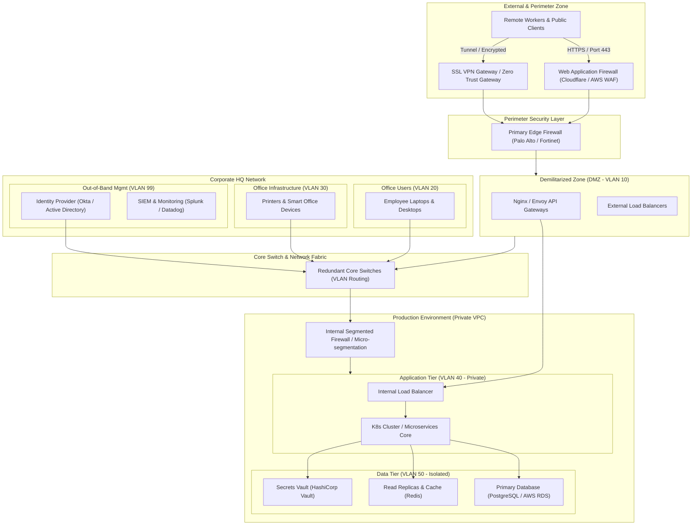

**Fictive Inc. Enterprise Network Architecture**

This network topology separates public traffic, internal services, corporate users, and sensitive data layers behind dedicated firewalls, VLANs, and security zones.

---

**Network Segmentation & Security Controls**

* **Perimeter Security:** All incoming traffic from the internet is scrubbed through the Web Application Firewall (WAF) to filter DDoS attacks and malicious web traffic before reaching the Edge Firewall.
* **Remote Access:** Remote staff access internal resources strictly through a Zero Trust Network Access (ZTNA) agent or SSL-VPN with mandatory Multi-Factor Authentication (MFA).
* **VLAN Segmentation:**
* **VLAN 10 (DMZ):** Houses public-facing API gateways and web servers.
* **VLAN 20 (Corporate):** Employee workstations separated from internal production servers.
* **VLAN 30 (IoT):** Smart office hardware isolated to prevent lateral network movement.
* **VLAN 40 (Production Apps):** Containerized app services closed off from direct internet access.
* **VLAN 50 (Isolated Data):** Strictly controls access to database clusters and secret vaults; reachable only by authorized application pods over encrypted internal links.
* **VLAN 99 (Management):** Out-of-band network for domain control, monitoring, and security logging tools.
